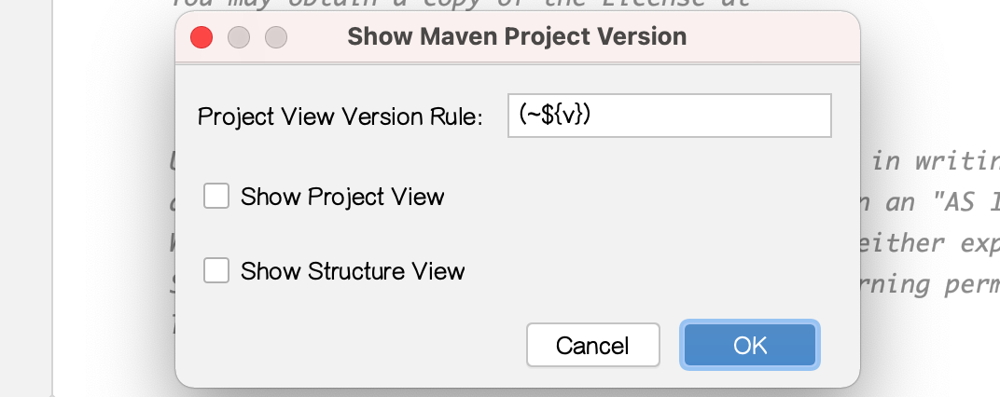

# MPVP(maven) 

    Maven Project Version Plugin.
  
   
## features

+ Maven Project Version Update
    
    
    
    - Default Strategy 
    
        - must have new version and changed version.
        - when version exist and matched will replace and support dependency version is special value (e.g: ${version} / [1.6, 1.8]) will continue replace.
    
    - General Strategy 
    
        - must have new version.
        - when version exist and matched will replace.
     
    - Support Must Same Version (Before) 
     
        - if checked: project or dependency version not equals project before replacement version will continue replace.
        - if not checked: new version will to replace.

     

+ Maven Project Version Show
    
     
    
    - project view
   
     

    - structure view

     
          

## install

 - intellij-maven-project-version-plugin-1.0.0.jar -> [src/test/resources/libs/intellij-maven-project-version-plugin-1.0.0.jar](src/test/resources/libs/intellij-maven-project-version-plugin-1.0.0.jar)

## other

 - plugin menu: Tools > Maven Project Version
 
 - build: build / intellij buildPlugin
 
 - test: intellij runIde
