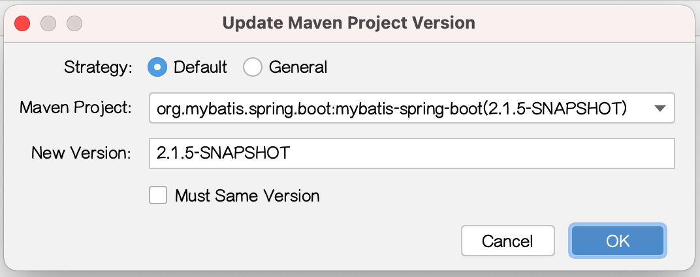

# intellij-maven-project-version-plugin

    
## features

+ Maven Project Version Update

+ Maven Project Version Show

 
          

## install

 - intellij-maven-project-version-plugin-1.0.0.jar -> [src/test/resources/libs/intellij-maven-project-version-plugin-1.0.0-SNAPSHOT.jar](src/test/resources/libs/intellij-maven-project-version-plugin-1.0.0.jar)

## other

 - build: build / intellij buildPlugin
 
 - test: intellij runIde

java.lang.NullPointerException
	at com.github.jokerpper.mavenprojectversion.ui.UpdateMavenProjectVersionForm$CustomListCellRenderer.getListCellRendererComponent(UpdateMavenProjectVersionForm.java:214)
	at com.intellij.openapi.ui.ComboBoxWithWidePopup$AdjustingListCellRenderer.getListCellRendererComponent(ComboBoxWithWidePopup.java:79)
	at com.intellij.ide.ui.laf.darcula.ui.DarculaComboBoxUI.paintCurrentValue(DarculaComboBoxUI.java:300)
	at com.intellij.ide.ui.laf.darcula.ui.DarculaComboBoxUI.paint(DarculaComboBoxUI.java:263)
	at java.desktop/javax.swing.plaf.ComponentUI.update(ComponentUI.java:161)
	at java.desktop/javax.swing.JComponent.paintComponent(JComponent.java:800)
	at java.desktop/javax.swing.JComponent.paint(JComponent.java:1077)
	at com.intellij.openapi.ui.ComboBox.paint(ComboBox.java:298)
	at java.desktop/javax.swing.JComponent.paintChildren(JComponent.java:910)
	at java.desktop/javax.swing.JComponent.paint(JComponent.java:1086)
	at java.desktop/javax.swing.JComponent.paintChildren(JComponent.java:910)
	at java.desktop/javax.swing.JComponent.paint(JComponent.java:1086)
	at java.desktop/javax.swing.JComponent.paintChildren(JComponent.java:910)
	at java.desktop/javax.swing.JComponent.paint(JComponent.java:1086)
	at java.desktop/javax.swing.JComponent.paintChildren(JComponent.java:910)
	at java.desktop/javax.swing.JComponent.paint(JComponent.java:1086)
	at java.desktop/javax.swing.JLayeredPane.paint(JLayeredPane.java:590)
	at java.desktop/javax.swing.JComponent.paintChildren(JComponent.java:910)
	at java.desktop/javax.swing.JComponent.paintToOffscreen(JComponent.java:5270)
	at java.desktop/javax.swing.RepaintManager$PaintManager.paintDoubleBufferedImpl(RepaintManager.java:1654)
	at java.desktop/javax.swing.RepaintManager$PaintManager.paintDoubleBuffered(RepaintManager.java:1629)
	at java.desktop/javax.swing.RepaintManager$PaintManager.paint(RepaintManager.java:1566)
	at java.desktop/javax.swing.BufferStrategyPaintManager.paint(BufferStrategyPaintManager.java:262)
	at java.desktop/javax.swing.RepaintManager.paint(RepaintManager.java:1333)
	at java.desktop/javax.swing.JComponent.paint(JComponent.java:1063)
	at java.desktop/java.awt.GraphicsCallback$PaintCallback.run(GraphicsCallback.java:39)
	at java.desktop/sun.awt.SunGraphicsCallback.runOneComponent(SunGraphicsCallback.java:78)
	at java.desktop/sun.awt.SunGraphicsCallback.runComponents(SunGraphicsCallback.java:115)
	at java.desktop/java.awt.Container.paint(Container.java:2002)
	at java.desktop/java.awt.Window.paint(Window.java:3941)
	at com.intellij.openapi.ui.impl.DialogWrapperPeerImpl$MyDialog.paint(DialogWrapperPeerImpl.java:798)
	at java.desktop/javax.swing.RepaintManager$4.run(RepaintManager.java:879)
	at java.desktop/javax.swing.RepaintManager$4.run(RepaintManager.java:851)
	at java.base/java.security.AccessController.doPrivileged(Native Method)
	at java.base/java.security.ProtectionDomain$JavaSecurityAccessImpl.doIntersectionPrivilege(ProtectionDomain.java:85)
	at java.desktop/javax.swing.RepaintManager.paintDirtyRegions(RepaintManager.java:851)
	at java.desktop/javax.swing.RepaintManager.paintDirtyRegions(RepaintManager.java:826)
	at java.desktop/javax.swing.RepaintManager.prePaintDirtyRegions(RepaintManager.java:775)
	at java.desktop/javax.swing.RepaintManager$ProcessingRunnable.run(RepaintManager.java:1901)
	at java.desktop/java.awt.event.InvocationEvent.dispatch(InvocationEvent.java:313)
	at java.desktop/java.awt.EventQueue.dispatchEventImpl(EventQueue.java:776)
	at java.desktop/java.awt.EventQueue$4.run(EventQueue.java:727)
	at java.desktop/java.awt.EventQueue$4.run(EventQueue.java:721)
	at java.base/java.security.AccessController.doPrivileged(Native Method)
	at java.base/java.security.ProtectionDomain$JavaSecurityAccessImpl.doIntersectionPrivilege(ProtectionDomain.java:85)
	at java.desktop/java.awt.EventQueue.dispatchEvent(EventQueue.java:746)
	at com.intellij.ide.IdeEventQueue.defaultDispatchEvent(IdeEventQueue.java:971)
	at com.intellij.ide.IdeEventQueue._dispatchEvent(IdeEventQueue.java:841)
	at com.intellij.ide.IdeEventQueue.lambda$dispatchEvent$8(IdeEventQueue.java:452)
	at com.intellij.openapi.progress.impl.CoreProgressManager.computePrioritized(CoreProgressManager.java:733)
	at com.intellij.ide.IdeEventQueue.lambda$dispatchEvent$9(IdeEventQueue.java:451)
	at com.intellij.ide.IdeEventQueue.dispatchEvent(IdeEventQueue.java:495)
	at java.desktop/java.awt.EventDispatchThread.pumpOneEventForFilters(EventDispatchThread.java:203)
	at java.desktop/java.awt.EventDispatchThread.pumpEventsForFilter(EventDispatchThread.java:124)
	at java.desktop/java.awt.EventDispatchThread.pumpEventsForFilter(EventDispatchThread.java:117)
	at java.desktop/java.awt.WaitDispatchSupport$2.run(WaitDispatchSupport.java:190)
	at java.desktop/java.awt.WaitDispatchSupport$4.run(WaitDispatchSupport.java:235)
	at java.desktop/java.awt.WaitDispatchSupport$4.run(WaitDispatchSupport.java:233)
	at java.base/java.security.AccessController.doPrivileged(Native Method)
	at java.desktop/java.awt.WaitDispatchSupport.enter(WaitDispatchSupport.java:233)
	at java.desktop/java.awt.Dialog.show(Dialog.java:1063)
	at com.intellij.openapi.ui.impl.DialogWrapperPeerImpl$MyDialog.show(DialogWrapperPeerImpl.java:711)
	at com.intellij.openapi.ui.impl.DialogWrapperPeerImpl.show(DialogWrapperPeerImpl.java:438)
	at com.intellij.openapi.ui.DialogWrapper.doShow(DialogWrapper.java:1700)
	at com.intellij.openapi.ui.DialogWrapper.show(DialogWrapper.java:1659)
	at com.github.jokerpper.mavenprojectversion.action.UpdateMavenProjectVersionAction.actionPerformed(UpdateMavenProjectVersionAction.java:18)
	at com.intellij.openapi.actionSystem.ex.ActionUtil.performActionDumbAware(ActionUtil.java:282)
	at com.intellij.openapi.actionSystem.impl.ActionMenuItem$ActionTransmitter.lambda$actionPerformed$0(ActionMenuItem.java:296)
	at com.intellij.openapi.wm.impl.FocusManagerImpl.runOnOwnContext(FocusManagerImpl.java:288)
	at com.intellij.openapi.wm.impl.IdeFocusManagerImpl.runOnOwnContext(IdeFocusManagerImpl.java:77)
	at com.intellij.openapi.actionSystem.impl.ActionMenuItem$ActionTransmitter.actionPerformed(ActionMenuItem.java:285)
	at java.desktop/javax.swing.AbstractButton.fireActionPerformed(AbstractButton.java:1967)
	at com.intellij.openapi.actionSystem.impl.ActionMenuItem.lambda$fireActionPerformed$0(ActionMenuItem.java:112)
	at com.intellij.openapi.application.TransactionGuardImpl.performUserActivity(TransactionGuardImpl.java:94)
	at com.intellij.openapi.actionSystem.impl.ActionMenuItem.fireActionPerformed(ActionMenuItem.java:112)
	at java.desktop/javax.swing.AbstractButton$Handler.actionPerformed(AbstractButton.java:2308)
	at java.desktop/javax.swing.DefaultButtonModel.fireActionPerformed(DefaultButtonModel.java:405)
	at java.desktop/javax.swing.JToggleButton$ToggleButtonModel.setPressed(JToggleButton.java:401)
	at java.desktop/javax.swing.AbstractButton.doClick(AbstractButton.java:369)
	at java.desktop/com.apple.laf.ScreenMenuItemCheckbox.itemStateChanged(ScreenMenuItemCheckbox.java:198)
	at java.desktop/java.awt.CheckboxMenuItem.processItemEvent(CheckboxMenuItem.java:396)
	at java.desktop/java.awt.CheckboxMenuItem.processEvent(CheckboxMenuItem.java:364)
	at java.desktop/java.awt.MenuComponent.dispatchEventImpl(MenuComponent.java:375)
	at java.desktop/java.awt.MenuComponent.dispatchEvent(MenuComponent.java:363)
	at java.desktop/java.awt.EventQueue.dispatchEventImpl(EventQueue.java:781)
	at java.desktop/java.awt.EventQueue$4.run(EventQueue.java:727)
	at java.desktop/java.awt.EventQueue$4.run(EventQueue.java:721)
	at java.base/java.security.AccessController.doPrivileged(Native Method)
	at java.base/java.security.ProtectionDomain$JavaSecurityAccessImpl.doIntersectionPrivilege(ProtectionDomain.java:85)
	at java.base/java.security.ProtectionDomain$JavaSecurityAccessImpl.doIntersectionPrivilege(ProtectionDomain.java:95)
	at java.desktop/java.awt.EventQueue$5.run(EventQueue.java:751)
	at java.desktop/java.awt.EventQueue$5.run(EventQueue.java:749)
	at java.base/java.security.AccessController.doPrivileged(Native Method)
	at java.base/java.security.ProtectionDomain$JavaSecurityAccessImpl.doIntersectionPrivilege(ProtectionDomain.java:85)
	at java.desktop/java.awt.EventQueue.dispatchEvent(EventQueue.java:748)
	at com.intellij.ide.IdeEventQueue.defaultDispatchEvent(IdeEventQueue.java:971)
	at com.intellij.ide.IdeEventQueue._dispatchEvent(IdeEventQueue.java:841)
	at com.intellij.ide.IdeEventQueue.lambda$dispatchEvent$8(IdeEventQueue.java:452)
	at com.intellij.openapi.progress.impl.CoreProgressManager.computePrioritized(CoreProgressManager.java:744)
	at com.intellij.ide.IdeEventQueue.lambda$dispatchEvent$9(IdeEventQueue.java:451)
	at com.intellij.openapi.application.impl.ApplicationImpl.runIntendedWriteActionOnCurrentThread(ApplicationImpl.java:802)
	at com.intellij.ide.IdeEventQueue.dispatchEvent(IdeEventQueue.java:505)
	at java.desktop/java.awt.EventDispatchThread.pumpOneEventForFilters(EventDispatchThread.java:203)
	at java.desktop/java.awt.EventDispatchThread.pumpEventsForFilter(EventDispatchThread.java:124)
	at java.desktop/java.awt.EventDispatchThread.pumpEventsForHierarchy(EventDispatchThread.java:113)
	at java.desktop/java.awt.EventDispatchThread.pumpEvents(EventDispatchThread.java:109)
	at java.desktop/java.awt.EventDispatchThread.pumpEvents(EventDispatchThread.java:101)
	at java.desktop/java.awt.EventDispatchThread.run(EventDispatchThread.java:90)

