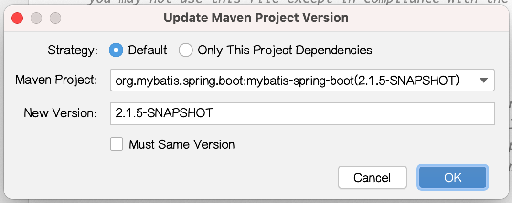
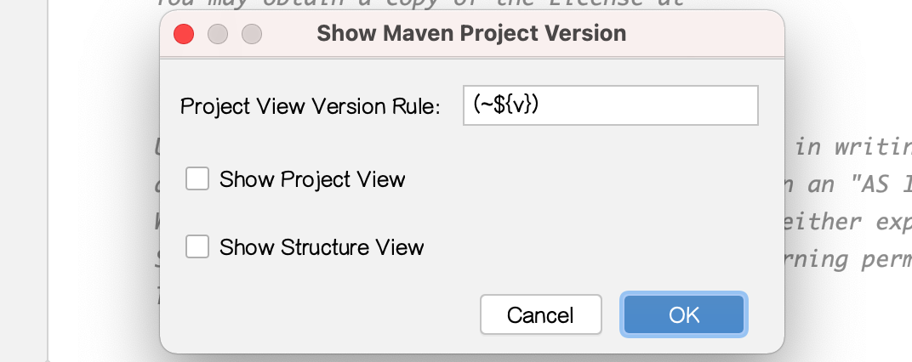
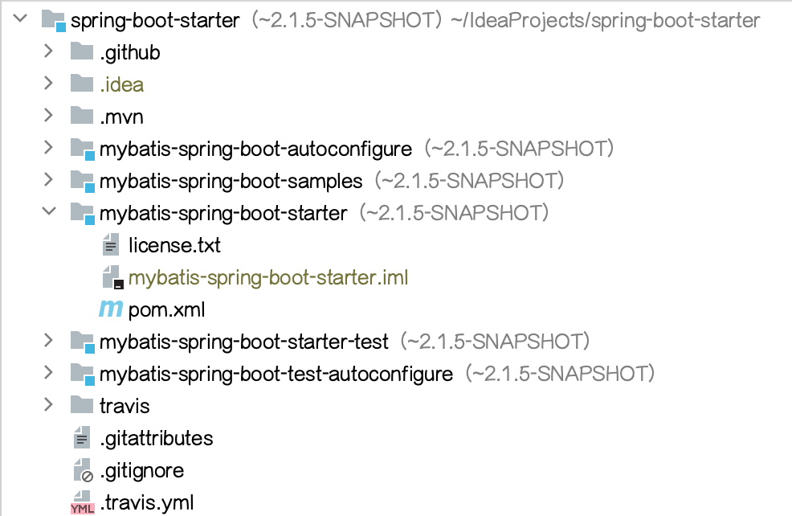
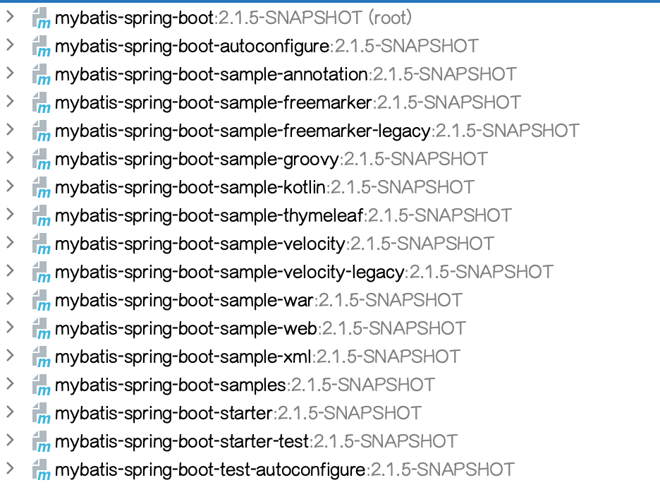

# MPVP(maven)  

  [中文](readme.md) / English

    Maven Project Version Plugin, Support Quick Update Version And Show Project Version.
  
   
## features

+ Maven Project Version Update
    
    
    
    - Default Strategy 
    
        - must have new version and changed version.
        - when version exist and matched will replace and support dependency version is special value (e.g: ${version} / [1.6, 1.8]) will continue replace.
    
    - General Strategy 
    
        - must have new version.
        - when version exist and matched will replace.
     
    - Support Must Same Version (Before) 
     
        - if checked: project or dependency version not equals project before replacement version will continue replace.
        - if not checked: new version will to replace.

     

+ Maven Project Version Show
    
     
    
    - project view
   
     

    - structure view

     
          

## internationalization support
   
  
  ### Version Requirements
  
     v1.0.1/v1.0.1+

  ### Language Configuration Priority Level 
  
    PROJECT > GLOBAL > SYSTEM

  ### Language Priority Level 
  
    language_country/area.properties > language.properties > en.properties

  ### Language Naming Rule
  
    method 1: language_country/area.properties，e.g: zh_CN.properties
  
    method 2: language.properties，e.g: zh.properties

  
  ### Internal System Language
             
   + zh         Chinese
   + zh_CN      Simplified Chinese（China）
   + zh_TW      Chinese（Taiwan）
   + en         English
      
  
  ### How to Specify The Current Used Language 
  
    The language to be used can be specified through the system default language or in conf.properties.
    

  - configuration file
   
    + global configuration: user home/mpvp/conf.properties
     
    + project configuration: user maven project work dir/.idea/mpvp/conf.properties
   
  - configuration file sample
   
     [src/test/resources/language-sample/mpvp/conf.properties](src/test/resources/language-sample/mpvp/conf.properties)
   
  
  ### How to Customize Language And Override Internal System Language Content
    
  - introduction to override function
                   
    When the content of the corresponding key for the current language in the configuration directory exists, priority will be given to using user language resources.
    If it does not exist, internal system language resources will be used for backup.

    
  - language configuration dir
  
    + global language configuration dir: user home/mpvp/language 
    
    + project language configuration dir: user maven project work dir/.idea/mpvp/language
  
  - language configuration sample
  
     [src/test/resources/language-sample/mpvp/language](src/test/resources/language-sample/mpvp/language)

## version

    x.x.1    ->   idea 2017.3 - 2022.1
    x.x.2    ->   idea 2022.2 - 2023.2
    x.x.3    ->   idea 2023.3 - ?

## install

 - intellij-maven-project-version-plugin-1.0.1.zip -> [src/test/resources/distributions/intellij-maven-project-version-plugin-1.0.1.zip](src/test/resources/distributions/intellij-maven-project-version-plugin-1.0.1.zip)

 - intellij-maven-project-version-plugin-1.0.1.jar -> [src/test/resources/libs/intellij-maven-project-version-plugin-1.0.1.jar](src/test/resources/libs/intellij-maven-project-version-plugin-1.0.1.jar)
 

## suggest
 
    Best to use ${project. version} to maintain consistency in the version values of sub module dependencies in multiple modules.

## other

 - plugin menu: Tools > Maven Project Version
 
 - build: build / intellij buildPlugin
 
 - test: intellij runIde
